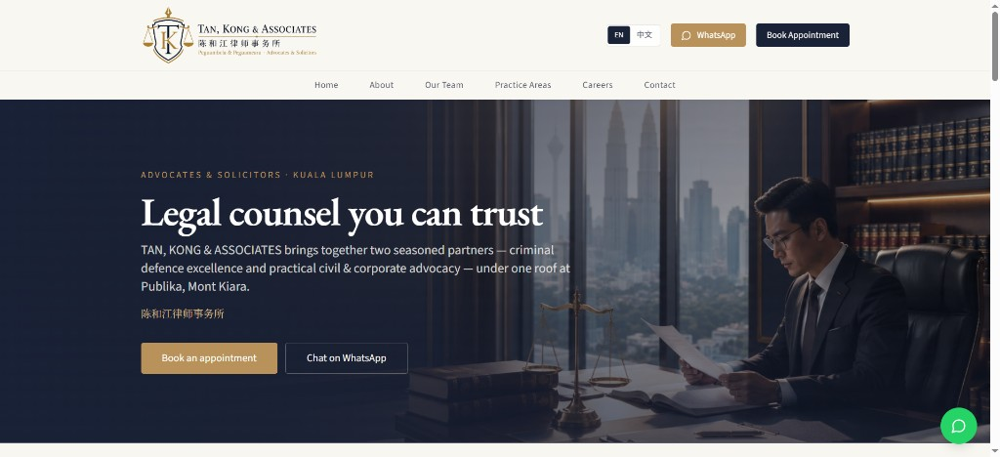
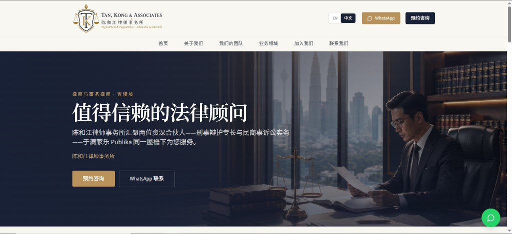
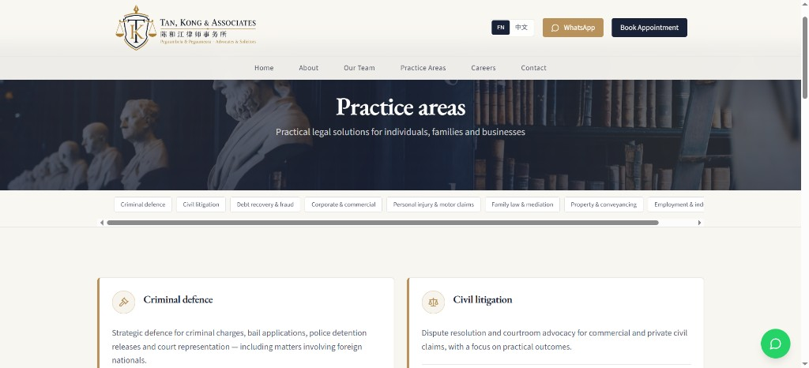
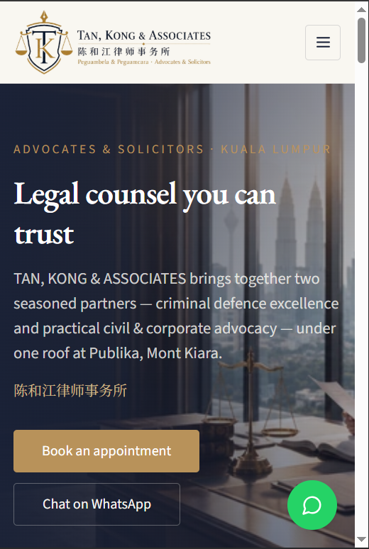

# Law Firm Marketing Website

[](https://nextjs.org/)
[](https://www.typescriptlang.org/)
[](https://tailwindcss.com/)
[](https://next-intl-docs.vercel.app/)

A bilingual (English / 中文) marketing and enquiry website for **TAN, KONG & ASSOCIATES** (陈和江律师事务所), a boutique Advocates & Solicitors practice in Publika, Mont Kiara, Kuala Lumpur.

**Live site:** [law-firm-website-one-pied.vercel.app](https://law-firm-website-one-pied.vercel.app)



## Project Overview

A two-partner law firm needed a credible online presence that serves a client base split across three languages, while ranking for local legal searches and surfacing correctly in AI assistants.

**Key challenge:** Malaysian legal clients search in English, Mandarin, and Bahasa Malaysia — and increasingly ask ChatGPT or Perplexity for a lawyer instead of using Google. A single-language brochure site would miss most of that demand.

**Solution:** Fully localized routing with per-locale metadata and `hreflang` alternates, layered on top of `LegalService` / `Attorney` / `FAQPage` structured data and an `llms.txt` manifest so AI crawlers can parse the firm's practice areas, partners, and location without guessing.

## Key Features

### Bilingual Architecture

- **Locale-prefixed routing** — every page exists at `/en/*` and `/zh/*` via `next-intl` middleware
- **Translated content layer** — all copy lives in `src/i18n/messages/{en,zh}.json`, no hardcoded strings in components
- **Localized data model** — partner names, roles, and spoken languages carry both English and Chinese variants (`nameZh`, `roleZh`, `languagesZh`)
- **`hreflang` alternates** — declared per route in metadata and in the generated sitemap

### AI & SEO Implementation

- **Schema.org structured data** — `LegalService` + `LocalBusiness` + `Attorney` graph with geo coordinates, opening hours, and `areaServed`
- **AI crawler access** — `robots.ts` explicitly allows `GPTBot`, `ChatGPT-User`, `Google-Extended`, `PerplexityBot`, and `ClaudeBot`
- **`llms.txt` manifest** — plain-text firm summary for LLM retrieval (practice areas, partners, contact)
- **FAQPage schema** — structured Q&A targeting featured snippets and AI answer boxes
- **Local SEO signals** — `PostalAddress`, `GeoCoordinates`, `knowsLanguage`, and `priceRange` for map-pack eligibility
- **Dynamic sitemap** — locale × route matrix including per-partner profile pages

### Conversion Path

- **Dual-CTA hero** — appointment booking alongside WhatsApp, the dominant channel in Malaysia
- **WhatsApp deep links** — prefilled per-partner messages so enquiries arrive pre-qualified
- **Floating WhatsApp widget** — partner picker available on every page
- **Appointment form** — matter type, preferred partner, and preferred date/time in one step
- **Practice area directory** — eight areas with filterable tags mapped to the right partner

### Server-Side Form Handling

- **Zod validation** — schema-validated payloads on the API route, not just the client
- **In-memory rate limiting** — 5 requests per IP per minute
- **Honeypot field** — silent bot rejection without a CAPTCHA
- **Resend delivery** — with a dev fallback that logs enquiries when no API key is present

## Tech Stack

- **[Next.js 15](https://nextjs.org/)** — App Router, Server Components, `next/image` optimization
- **[TypeScript 5](https://www.typescriptlang.org/)** — `as const` firm data model for type-safe content
- **[Tailwind CSS 3](https://tailwindcss.com/)** — utility-first styling with brand design tokens
- **[shadcn/ui](https://ui.shadcn.com/)** — Radix-based accessible primitives
- **[next-intl](https://next-intl-docs.vercel.app/)** — routing, middleware, and message catalogs
- **[Framer Motion](https://www.framer.com/motion/)** — scroll reveals and Ken Burns hero motion, all `prefers-reduced-motion` aware
- **[Resend](https://resend.com/)** + **[Zod](https://zod.dev/)** — transactional email and validation
- **[Vercel](https://vercel.com/)** — edge deployment with preview builds

## Screenshots

<table>
  <tr>
    <td align="center" width="50%">
      <br />
      <sub>Same page at <code>/zh</code> — navigation, hero copy, and CTAs all localized</sub>
    </td>
    <td align="center" width="50%">
      <br />
      <sub>Practice areas with filterable tags</sub>
    </td>
  </tr>
</table>

<p align="center">
  <br />
  <sub>Mobile layout with focal-point hero cropping</sub>
</p>

## Quick Start

```bash
npm install
cp .env.example .env.local
npm run dev
```

Open [http://localhost:3000](http://localhost:3000) — it redirects to `/en`.

Enquiries are logged to the console until `RESEND_API_KEY` is set, so the contact form is testable without any email setup.

## Environment

| Variable | Purpose |
|----------|---------|
| `NEXT_PUBLIC_SITE_URL` | Canonical URL for sitemap, `hreflang`, and Open Graph tags |
| `RESEND_API_KEY` | Email delivery (optional in dev — enquiries are logged instead) |
| `CONTACT_TO_EMAIL` | Inbox that receives form submissions |
| `CONTACT_FROM_EMAIL` | Verified Resend from-address |

## Content Updates

Firm details are centralized so copy changes never touch components:

- `src/lib/firm.ts` — firm identity, address, hours, partner records, practice area IDs
- `src/i18n/messages/en.json` — all English copy
- `src/i18n/messages/zh.json` — all Chinese copy
- `public/llms.txt` — AI-facing firm summary
- `DESIGN.md` — brand tokens and UI rules

## Project Structure

```
src/app/[locale]/     Localized routes (home, about, team, practice areas, careers, contact, booking)
src/app/api/contact/  Validated enquiry endpoint with rate limiting
src/components/       Layout, motion, SEO, form, and UI components
src/i18n/             Routing config and EN/ZH message catalogs
src/lib/firm.ts       Single source of truth for firm and partner data
public/hero/          Hero imagery per page
```

## Structured Data

JSON-LD emitted from [`src/components/seo/json-ld.tsx`](src/components/seo/json-ld.tsx):

- **LegalService / LocalBusiness / Attorney** — firm identity, geo, hours, languages, service area
- **Attorney** (per partner) — role, contact, spoken languages, `worksFor` relation to the firm
- **FAQPage** — location, practice areas, and language-capability questions

## Deployment

```bash
# Deploy to production
npx vercel --prod

# Or push to main for automatic deployment
git push origin main
```

## Portfolio Notes

**Skills demonstrated:**

- Internationalized routing and content architecture (`next-intl`, locale-aware metadata, `hreflang`)
- Schema.org modeling for a regulated professional-services vertical
- GEO / AI-search optimization (crawler allowlisting, `llms.txt`, answer-shaped content)
- Secure server-side form handling (Zod validation, rate limiting, honeypot)
- Accessible motion design with `prefers-reduced-motion` fallbacks
- Type-safe content modeling with a single source of truth

**Outcome:** A bilingual firm website with strong local-SEO foundations, AI-assistant discoverability, and a two-channel enquiry path — maintainable by editing two JSON files and one data module.

## License

MIT © 2026 — See [LICENSE](LICENSE) for details.
